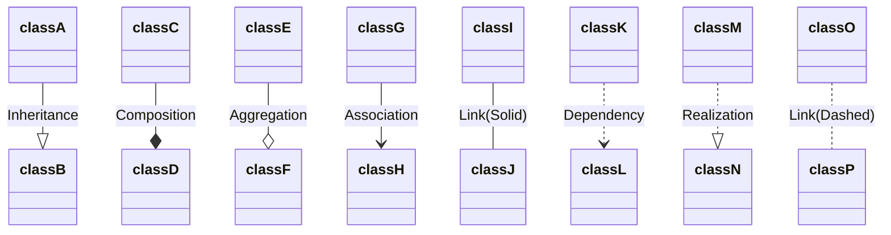
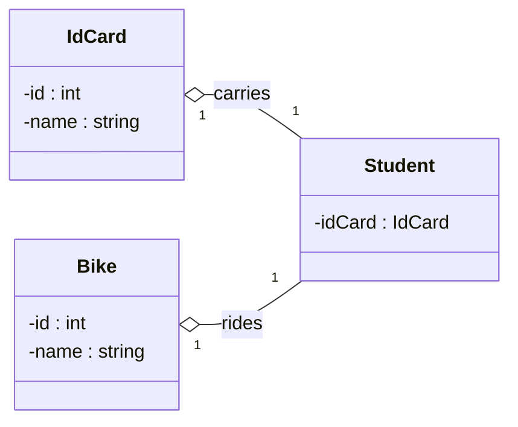
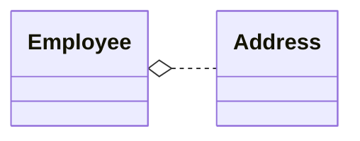
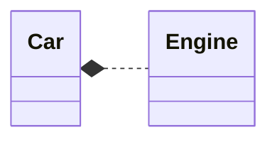

# [Defining Relationship](https://mermaid.js.org/syntax/classDiagram.html)

- 표기법 [classA][Arrow][ClassB]


- `<|--`	Inheritance
- `*--`	Composition
- `o--`	Aggregation
- `-->`	Association
- `--`	Link (Solid)
- `..>`	Dependency
- `..|>`	Realization
- `..`	Link (Dashed)

#

- Cardinality / Multiplicity on relations
  - `1 Only 1` 
  - `0..1` Zero or One 
  - `1..*` One or more
  - `*` Many
  - `n n`
  - `0..n` zero to n
  - `1..n` one to n

#

## Dependency(의존) vs Aggregation(집합) vs  Composition (합성)
- Dependency
  - 객체의 참조가 function 스코프 내에서만 이뤄질 때
- Aggregation
  - 컴포지션과 동일하게 객체가 어느 객체의 구성 요소일 때를 말한다. 차이점이라 하면 생성자의 차이인데,   
  Aggregation 은 생성자 파라미터로 전달되는 참조 변수가 외부 어디선가 생성된 객체의 참조 변수다. 
  - 아래 예시를 보면 Employee 생성자에 전달되는 Address 참조변수는 Employee 클래스 외부 어디선가에서 생성된 객채의 참조변수다.
- Composition
  - Aggregation 보다 강한 집합 
  - Composition 은 component 객체가 the entire composite object 내부에서만 유효한 경우를 말한다.  
  아래 예시를 들면 Car클래스의 컴포넌트인 Engine은 Car 내부에서만 유효하며 Car 외부 클래스에선 존재해선 안된다.



```java
class Employee {
    private Address address;

    // constructor 
    public Employee( Address address ) {
        this.address = address;
    }

    public Address getAddress() {
    return this.address;
    }
    public void setAddress( Address address ) {
        this.address = address;
    }
}
```

```java
final class Car {

  private final Engine engine;

  Car(EngineSpecs specs) {
    engine = new Engine(specs);
  }

  void move() {
    engine.work();
  }
}
```