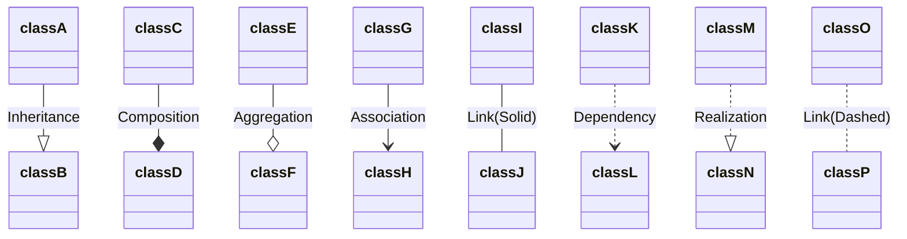

# [Defining Relationship](https://mermaid.js.org/syntax/classDiagram.html)

- 표기법 [classA][Arrow][ClassB]

- <|--	Inheritance
- \*--	Composition
- o--	Aggregation
- -->	Association
- --	Link (Solid)
- ..>	Dependency
- ..|>	Realization
- ..	Link (Dashed)