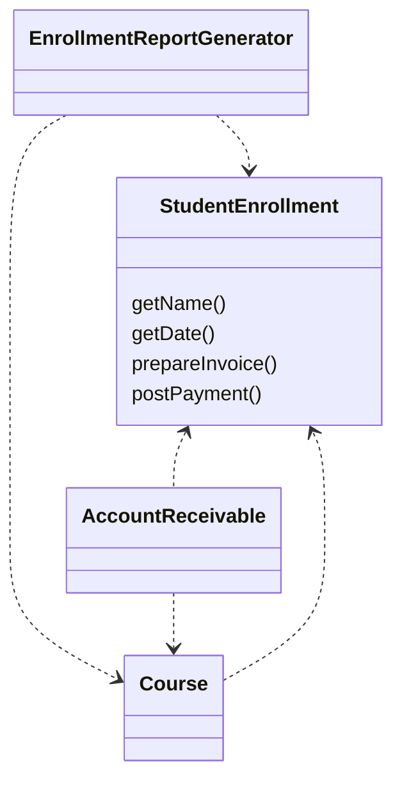

# 인터페이스 격리 원칙(Interface Segregation Principle, ISP)

## 인터페이스는 자신이 사용하지 않는 메서드에 의존 관계를 맺으면 안 된다



```java
public class StudentEnrollment {

    public String getName(String parameter){
        return "NAME";
    }

    public String getDate(String parameter){
        return "DATE";
    }

    public void prepareInvoice(String parameter){

    }

    public void postPayment(String parameter){

    }
}

public class EnrollmentReportGenerator {

    private StudentEnrollment studentEnrollment;

    public void generateReport() {
        studentEnrollment.getDate("param");
        studentEnrollment.getName("param");
    }
}

```

EnrollmentReportGenerator 가 prepareInvoice 나 postPayment 같은 메서드는 사용하지 않으리라는 것은 명백하다.

문제 상황)
- 요구사항이 변해서 postPayment 메서드에 새 인자를 추가할 수밖에 없다고 하면 무슨 일이 일어날까?
- StudentEnrollment의 선언을 바꾸는 이 변화 때문에 EnrollmentReportGenerator를 다시 컴파일하고 배포해야 할지도 모른다

해결)
- 사용자게엑 딱 필요한 메서드만 있는 인터페이스를 제공해서 필요하지 않는 메서드에서 사용자를 보호하라

```java

public interface EnrollmentAccounting {
    void prepareInvoice();
    void postPayment();
}

public interface EnrollmentReporter {
    String getName(String param);
    LocalDate getDate(String param);
}

public class StudentEnrollment implements EnrollmentReporter, EnrollmentAccounting {

    @Override
    public String getName(String parameter) {
        System.out.println("StudentEnrollment.getName");
        return "NAME";
    }

    @Override
    public LocalDate getDate(String parameter) {
        System.out.println("StudentEnrollment.getDate");
        return LocalDate.now();
    }

    @Override
    public void prepareInvoice() {

    }

    @Override
    public void postPayment() {

    }
}

public class EnrollmentReportGenerator {

    private EnrollmentReporter enrollmentReporter;

    public void generateReport() {
        enrollmentReporter.getDate("param");
        enrollmentReporter.getName("param");
    }
}
```