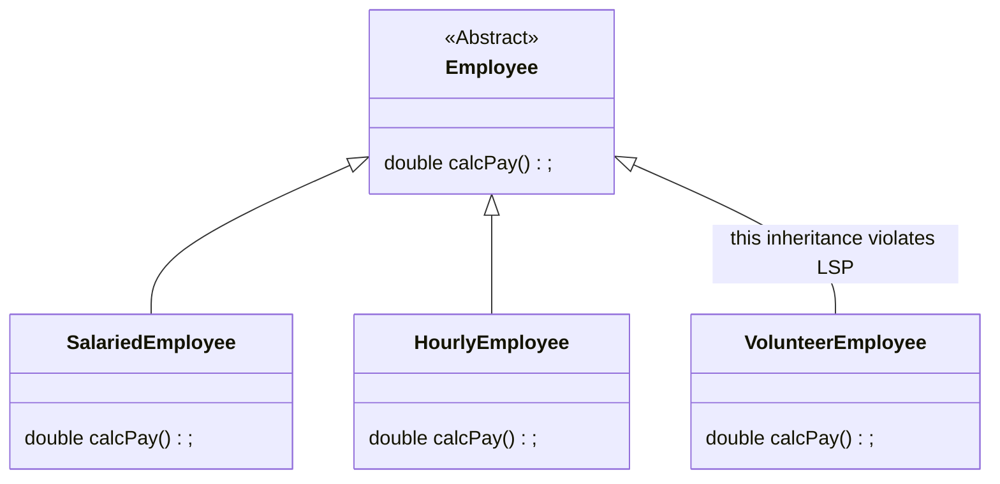

# Liskov Substitution Principle
### 서브타입은 언제나 자신의 기반 타입으로 교체할 수 있어야 한다



```java
        List<Employee> employees = List.of(new SalariedEmployee(), new HourlyEmployee(), new VolunteerEmployee());

        for (int i = 0; i < employees.size(); i++){
            Employee employee=employees.get(i);
            // try-catch -> 파생 클래스의 제약이 기반 클래스의 사용자에게도 영향을 미치는 상황이 발생
            try{
                totalPay+=employee.calcPay();
            }catch(UnpayableEmployeeException e){
                e.printStackTrace();
            }
        }
```

```java

    private static double violateLSP_case2( ) throws UnpayableEmployeeException {

        double totalPay = 0;

        List<Employee> employees = List.of(new SalariedEmployee(), new HourlyEmployee(), new VolunteerEmployee());
        for (int i = 0; i < employees.size(); i++) {

            Employee employee = employees.get(i);
            // LSP 위반 :  이 경우는 Employee 라는 기반 클래스로 작업하던 코드에서 이제는 이 기반 클래스에서 유도된 클래스까지 명시해야 한다.
            // Employee 사용자는 VolunteerEmployee 가 있다는 사실만으로도 영향을 받는다.
            // instanceof 구문은 OCP 도 어긴다
            if (!(employee instanceof VolunteerEmployee))
            totalPay += employee.calcPay();
        }
        return totalPay;
    }

```

## 해결책?
자원 봉사자는 직원이 아니다. 자원 봉사자의 calcPay를 호출하는 것은 이치에 어긋나므로,  
애초에 Employee 클래스에서 파생해서는 안 되고, 
함수 내부에서 calcPay를 호출하는 함수에 전달해서도 안 된다.