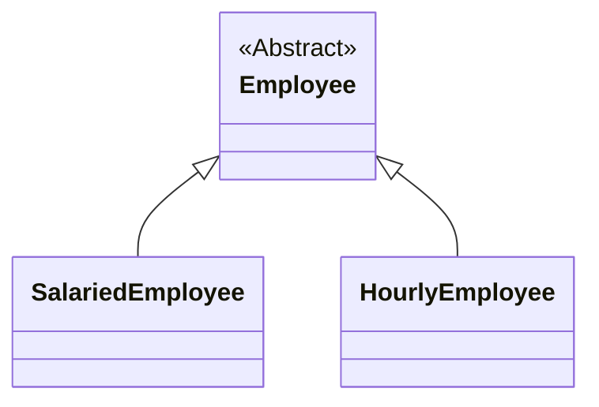

# Liskov Substitution Principle
### 서브타입은 언제나 자신의 기반 타입으로 교체할 수 있어야 한다

```mermaid
    classDiagram 
        class Employee {
            <<Abstract>>
        }
        Employee <|-- SalariedEmployee
        Employee <|-- HourlyEmployee
    
```