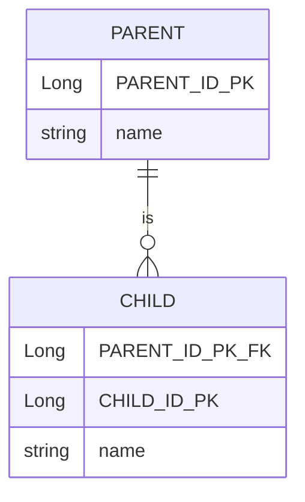
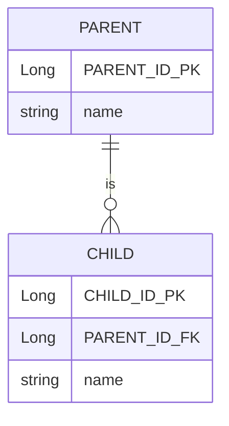
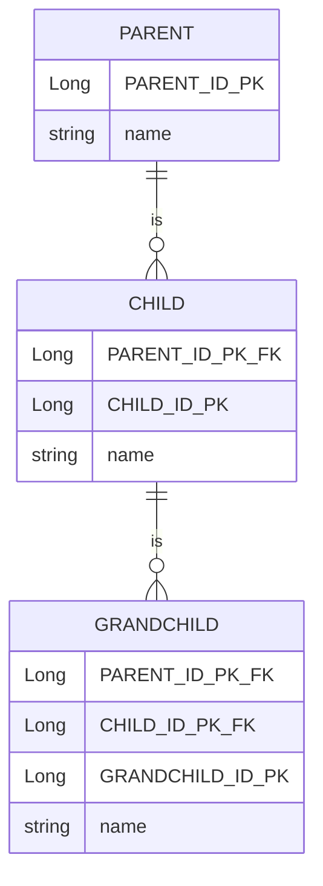
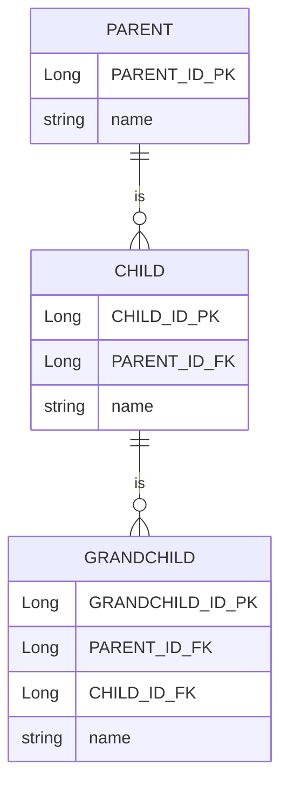

관계형 데이터베이스에는 상속이라는 개념 대신 슈퍼타입 서브타입 관계라는 모델링 기법이 객체의 상속 개념과 가장 유사함
ORM 에서 이야기하는 상속 관계 매핑은 객체의 상속 구조와 데이터베이스의 슈퍼타입 서브타입 관계를 매핑하는 것

## 상속 관계 매핑
슈퍼타입 서브타입 논리 모델을 실제 물리 모델인 테이블로 구현할 때 3가지 방법이 있음
1. 각각의 테이블로 변환
   각각을 모두 테이블로 만들고 조회할 때 조인을 사용
2. 통합 테이블로 변환
   같은 테이블을 하나만 사용해서 통합
3. 서브타입 테이블로 변환
   서브 타입마다 하나의 테이블을 만든다

### 조인전략
- 자식 테이블이 부모 테이블의 기본 키를 받아서 (기본키+외래키)로 사용하는 전략
  장점
1. 테이블이 정규화된다.
2. 외래 키 참조 무결성 제약조건을 활용할 수 있다.
3. 저장공간을 효율적으로 사용한다.

단점
1. 조회할 때 조인이 많이 사용되므로 성능이 저하될 수 있다.
2. 조회 쿼리가 복잡하다.
3. 데이터를 등록할 INSERT SQL을 두 번 실행한다.

```shell
    create table album (
        artist varchar(255),
        item_id bigint not null,

        primary key (item_id)
    )

    create table book (
        author varchar(255),
        isbn varchar(255),
        book_id bigint not null,

        primary key (book_id)
    )

    create table item (
       dtype varchar(31) not null,
        item_id bigint not null,
        name varchar(255),
        price integer not null,

        primary key (item_id)
    )

    create table movie (
        actor varchar(255),
        director varchar(255),
        item_id bigint not null,

        primary key (item_id)
    )

    alter table album
       add constraint FKminb9nib0bo4t9c4kpltxtuab
       foreign key (item_id)
       references item

    alter table book
       add constraint FKd6yi4gonrl3aka8s8v65vc5pm
       foreign key (book_id)
       references item

    alter table movie
       add constraint FKq2rg7rpjfg38px01dhl4qrik6
       foreign key (item_id)
       references item

    Hibernate:
        call next value for hibernate_sequence
    Hibernate:
        insert
        into
            item
            (name, price, dtype, item_id)
        values
            (?, ?, 'A', ?)
    Hibernate:
        insert
        into
            album
            (artist, item_id)
        values
            (?, ?)
```

### 단일 테이블 전략
- 테이블을 하나로만 사용. 조회시 조인을 사용하지 않으므로 일반적으로 가장 빠름
- 주의사항 : 자식 엔티티가 매핑한 컬럼은 모두 null 을 허용해야한다

장점
1. 조인이 필요 없으므로 일반적으로 조회 성능이 빠르다
2. 조회 쿼리가 단순하다

단점
1. 단일 테이블에 모든 것을 저장하므로 테이블이 커질 수 있다.
   그러므로 상황에 따라서는 조회 성능이 오히려 느려질 수 있다.

특징
1. 구분 컬럼을 꼭 사용해야 한다. ```@DiscriminatorColumn```을 꼭 설정할 구현할 것
```shell
    create table item (
        dtype varchar(31) not null,
        item_id bigint not null,
        name varchar(255),
        price integer not null,
        artist varchar(255),
        author varchar(255),
        isbn varchar(255),
        actor varchar(255),
        director varchar(255),
        primary key (item_id)
    )

      insert
        into
            item
            (name, price, artist, dtype, item_id)
        values
            (?, ?, ?, 'A', ?)

    binding parameter [1] as [VARCHAR] - [RUN]
    binding parameter [2] as [INTEGER] - [32000]
    binding parameter [3] as [VARCHAR] - [BTS]
    binding parameter [4] as [BIGINT] - [1]
```

### 구현 클래스마다 테이블 전략
- 자식 엔티티마다 테이블을 만든다. 일반적으로 추천하지 않는 전략
  장점
1. 서브 타입을 구분해서 처리할 때 효과적
2. not null 제약조건을 사용할 수 있음
   단점
1. 여러 자식 테이블을 함께 조회할 때 성능이 느리다. (SQL, UNION 사용해야 함)
2. 자식 테이블을 통합해서 쿼리하기 어렵다
   특징
1. 구분 컬럼을 사용하지 않는다.

```shell
Hibernate:

    create table album (
       item_id bigint not null,
        name varchar(255),
        price integer not null,
        artist varchar(255),
        primary key (item_id)
    )
Hibernate:

    create table book (
       item_id bigint not null,
        name varchar(255),
        price integer not null,
        author varchar(255),
        isbn varchar(255),
        primary key (item_id)
    )
Hibernate:

    create table delivery (
       delivery_id bigint not null,
        primary key (delivery_id)
    )
Hibernate:

    create table movie (
       item_id bigint not null,
        name varchar(255),
        price integer not null,
        actor varchar(255),
        director varchar(255),
        primary key (item_id)
    )
    insert
    into
        album
        (name, price, artist, item_id)
    values
        (?, ?, ?, ?)

    binding parameter [1] as [VARCHAR] - [RUN]
    binding parameter [2] as [INTEGER] - [32000]
    binding parameter [3] as [VARCHAR] - [BTS]
    binding parameter [4] as [BIGINT] - [1]
```

## @MappedSuperclass

## 복합 키와 식별 관계 매핑
- 복합 키를 매핑하는 방법과 식별 관계, 비식별 관계를 매핑하는 방법

식별 관계 vs 비식별 관계
- 외래 키가 기본 키에 포함되는지 여부에 따라 구분

### 식별 관계
- 부모 테이블의 기본 키를 내려받아서 자식 테이블의 (기본 키 + 외래 키)로 사용하는 관계


### 비식별 관계
- 부모 테이블의 기본 키를 받아서 자식 테이블의 외래 키로만 사용하는 관계

- 필수적 비식별 관계  
외래 키 Null 허용하지 않는다. 연관관계 필수

- 선택적 비식별 관계  
외래 키에 Null 허용한다. 연관관계 선택적


### 식별 관계와 비식별 관계 매핑 방법
1. 복합 키를 사용하는 비식별 관계 매핑  
JPA는 영속성 컨텍스트에 엔티티를 보관할 때 엔티티의 식별자를 키로 사용하는데, 식별자 구분에 equals&hashCode 를 사용해 동등성을 비교한다.  
식별자 필드가 하나일 때는 자바의 기본 타입을 사용하므로 문제가 없으나, 식별자 필드가 2개 이상이면 식별자 클래스에 equals&hashCode 를 구현해야 한다.  

```shell
엔티티에 @IdClass 나 @EmbeddedId 없이 @Id 필드를 두개 선언했을 경우 에러 로그

Unable to build Hibernate SessionFactory; nested exception is org.hibernate.MappingException: 
Composite-id class must implement Serializable: com.jpashop.spring_jpa_advanced.supersub.Parent
```

식별자 클래스 @IdClass, @EmbeddedId 2가지 방법 있음

- @IdClass
```java
@Entity
@IdClass(ParentId.class)
public class Parent {

    @Id
    @Column(name = "PARENT_ID1")
    private String id1;

    @Id
    @Column(name = "PARENT_ID2")
    private String id2;

    private String name;

    protected Parent(){}

    public Parent(String id1, String id2, String name) {
        this.id1 = id1;
        this.id2 = id2;
        this.name = name;
    }
}
```
```java
public class ParentId implements Serializable {

    private String id1;
    private String id2;

    public ParentId(){}

    public ParentId(String id1, String id2) {
        this.id1 = id1;
        this.id2 = id2;
    }

    @Override
    public boolean equals(Object o) {
        if (this == o) return true;
        if (o == null || getClass() != o.getClass()) return false;
        ParentId parentId = (ParentId) o;
        return Objects.equals(id1, parentId.id1) && Objects.equals(id2, parentId.id2);
    }

    @Override
    public int hashCode() {
        return Objects.hash(id1, id2);
    }
}
```

@IdClass 식별자 클래스의 필수 조건
1. 식별자 클래스의 속성명과 엔티티에서 사용하는 식별자의 속성명이 같아야 한다. 
2. Serializable 인터페이스를 구현해야 한다.
3. equals, hashCode를 구현해야 한다.
4. 기본 생성자가 있어야 한다.
5. 식별자 클래스는 public 이어야 한다.

!! 복합 키에는 @GenerateValue를 사용할 수 없다. 복합 키를 구성하는 여러 컬럼 중 하나에도 사용할 수 없다  
#

2. 복합 키를 사용하는 식별 관계 매핑



부모, 자식, 손자까지 계속 기본 키를 전달하는 식별 관계다.  
식별 관계에서 자식 테이블은 부모 테이블의 기본 키를 포함해서 복합 키를 구성해야 하므로 @IdClass 나 @EmbeddedId를 사용해서 식별자를 매핑해야 한다.  

- @IdClass 로 테스트 로그
```shell

Hibernate: 
    
    create table car (
       car_id varchar(255) not null,
        name varchar(255),
        primary key (car_id)
    )
      
Hibernate: 
    
    create table genesisgv80 (
       genesisgv80_id varchar(255) not null,
        name varchar(255),
        car_id varchar(255) not null,
        suv_id varchar(255) not null,
        primary key (genesisgv80_id, car_id, suv_id)
    )
      
Hibernate: 
    
    create table suv (
       car_id varchar(255) not null,
        suv_id varchar(255) not null,
        name varchar(255),
        primary key (car_id, suv_id)
    )
      
Hibernate: 
    
    alter table genesisgv80 
       add constraint FKqie0odpb582lasaubhnhd56db 
       foreign key (car_id, suv_id) 
       references suv
       
Hibernate: 
    
    alter table suv 
       add constraint FK5y0vcsrwyvqhgudbtbobafy4g 
       foreign key (car_id) 
       references car

Hibernate: 
    insert 
    into
        car
        (name, car_id) 
    values
        (?, ?)
binding parameter [1] as [VARCHAR] - [자동차]
binding parameter [2] as [VARCHAR] - [car id 1]

Hibernate: 
    insert 
    into
        suv
        (name, car_id, suv_id) 
    values
        (?, ?, ?)
binding parameter [1] as [VARCHAR] - [SUV]
binding parameter [2] as [VARCHAR] - [car id 1]
binding parameter [3] as [VARCHAR] - [suv id 1]

Hibernate: 
    insert 
    into
        genesisgv80
        (name, genesisgv80_id, car_id, suv_id) 
    values
        (?, ?, ?, ?)
        
binding parameter [1] as [VARCHAR] - [GV80]
binding parameter [2] as [VARCHAR] - [GV80 id 1]
binding parameter [3] as [VARCHAR] - [car id 1]
binding parameter [4] as [VARCHAR] - [suv id 1]
```


3. 식별 관계를 비식별 관계로 변경해보기

복합 키가 없으므로 복합 키 클래스를 만들지 않아도 된다.